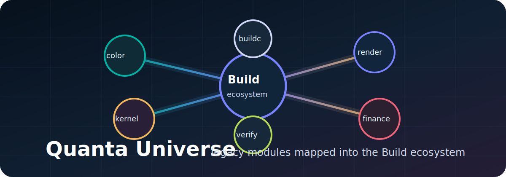

# Quanta Universe v1.0.0



> Legacy Quanta Universe modules mapped into the current BuildLang / Project Telos ecosystem.

[](LICENSE)


[](https://github.com/HarperZ9/quanta-universe/actions/workflows/ci.yml)

[](https://github.com/HarperZ9/quanta-universe)

A physics-inspired software ecosystem: programming language, operating system kernel, graphics engines, trading systems, and AI frameworks. The current public language/toolchain names are **BuildLang**, **`buildc`**, and **`.bld`**; this repository still contains historical `.quanta` modules that document the earlier Quanta Universe lineage.

## Current status

Quanta Universe is an alpha ecosystem archive and showcase, not a single
installable product. Treat it as the Build ecosystem map: language experiments,
color and rendering modules, OS/kernel work, finance models, calibration code,
and organism verification tooling collected in one place.

The compiler/toolchain lives in the separate BuildLang repository. This repo's
local `.quanta` files are legacy source assets until they are migrated or
bridged into `.bld`. `STATUS.md` is the canonical maturity ledger.

## Modules

### Core
- **BuildLang** - Multi-paradigm systems language with algebraic effects, ownership, and a production C backend (HLSL/GLSL/LLVM/x86-64/ARM64/WASM/SPIR-V backends exist but are experimental and do not yet emit runnable artifacts)
- **QuantaOS** - Hobby OS kernel (x86-64, ext2/4, context switching, memory management)
- **Axiom** - Neural architecture search and differentiable program synthesis

### Graphics
- **Photon** - Game rendering engine with shader injection and SPIR-V support
- **Spectrum** - Color science (ACES, Display P3, Rec.2020, spectral rendering)
- **Chromatic** - Perceptual color spaces (Oklab, JzAzBz, ICtCp, CAM16)
- **Lumina** - Post-processing pipeline
- **Nexus** - Universal mod framework
- **Prism** - Shader collection
- **Refract** - ENB integration
- **Neutrino** - Neural rendering effects

### Finance
- **Quantum Finance** - Algorithmic trading (momentum, mean reversion, stat arb)
- **Field Tensor** - 4D market data structure
- **Delta** - Options pricing and Greeks (Black-Scholes, binomial, Monte Carlo)
- **Entropy** - ML feature engineering and model training

### Integration
- **Entangle** - PC-mobile sync
- **Calibrate** - Display calibration
- **Nova** - Rendering presets

### Intelligence
- **Oracle** - Time-series forecasting (ARIMA, Holt-Winters, anomaly detection)
- **Wavelength** - Media processing

### Tools
- **Forge** - Developer tools (formatter, linter, debugger, profiler)
- **Foundation** - Standard library

## Status

**Alpha.** The BuildLang compiler (Rust; 755 test functions in tree) is the most mature component. The C backend produces correct native binaries. HLSL/GLSL produce clean shader output. Other backends are experimental. The historical `.quanta` modules demonstrate the language lineage across domains. See [quantaos/STATUS.md](quantaos/STATUS.md) for kernel implementation state.

### Publication Map

Split-repo package metadata now lives in [tools/package-index.toml](tools/package-index.toml).
Module slugs follow lowercase-hyphen naming for public-facing package IDs.
Use [releases/release-candidates.md](releases/release-candidates.md) for the
current publish dashboard and [tools/showcase.md](tools/showcase.md) for the
audience-facing module surface.

## Usage

This is a multi-module ecosystem, not a single installable package. The two
things you actually run are the BuildLang compiler/toolchain for source files
and the Python organism tooling (`tools/verify_organism.py`,
`tools/release_plan.py`). See **[USAGE.md](USAGE.md)** for install/build lines,
the real commands, and worked examples. A runnable demo lives in
[examples/demo/](examples/demo/).

Quick orientation:

```sh
# 1. Verify which components actually build/pass on this machine (no compiler needed)
python tools/verify_organism.py --quick

# 2. Transpile a module or program to C with the BuildLang compiler (separate repo)
buildc programs/echo.bld --target c -o /dev/null
```

`buildc` comes from the separate [BuildLang compiler repo](https://github.com/HarperZ9/quantalang)
repo (build it with `cargo build --release`); it is not bundled here.

## For developers

Use the organism tooling for this repo's own health checks:

```bash
python tools/verify_organism.py --quick
python tools/release_plan.py
git diff --check
```

When editing module metadata, keep `STATUS.md`, `tools/components.toml`,
`tools/package-index.toml`, `USAGE.md`, and this README aligned. Do not claim
whole-ecosystem buildability unless `tools/verify_organism.py` proves it.

## Caveats

- **This ecosystem does not compile as a whole.** Each module depends on the BuildLang compiler (separate repo: [HarperZ9/quantalang](https://github.com/HarperZ9/quantalang)). The compiler can compile individual modules but cross-module resolution is not yet complete.
- **QuantaOS** is an educational hobby kernel, not a production OS. See [quantaos/STATUS.md](quantaos/STATUS.md).
- **Axiom** is an experimental proof-of-concept for differentiable program synthesis.
- The `.quanta` source files serve as historical working code and language specification material while the current public surface moves to `.bld`.

## Ground Truth

This repo previously carried conflicting claims across README, ENGINEERING, and CHANGELOG. Authoritative per-module reality now lives in:

- [STATUS.md](STATUS.md) - module maturity ledger (real vs scaffolding). Where any doc disagrees, STATUS.md is canonical.
- [LINEAGE.md](LINEAGE.md) - the Quanta family tree and how the mixed-language pieces interlace.
- [docs/HEATMAP-AND-ACTION-PLAN.md](docs/HEATMAP-AND-ACTION-PLAN.md) - engineering heatmap and prioritized plan.

## License

MIT License. See [LICENSE](LICENSE).
