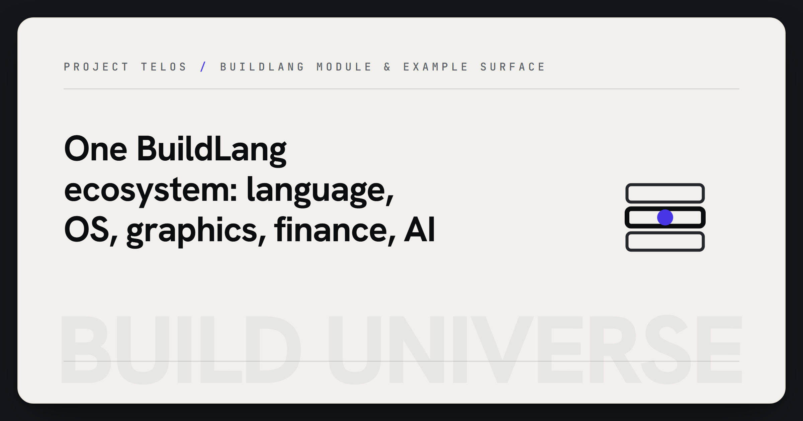

  

# Build Universe v1.0.0

> A physics-inspired compiler ecosystem: the BuildLang language and standard library, a Rust compiler that transpiles `.bld` to C, and a Rust OS kernel.

[Project Telos](https://harperz9.github.io) | [gather](https://github.com/HarperZ9/gather) | [crucible](https://github.com/HarperZ9/crucible) | [index](https://github.com/HarperZ9/index) | [forum](https://github.com/HarperZ9/forum) | [telos](https://github.com/HarperZ9/telos) | [emet](https://github.com/HarperZ9/emet) | [buildlang](https://github.com/HarperZ9/buildlang)

An alpha compiler ecosystem, mixed-language by design. The pieces are not "all written in BuildLang":

- **BuildLang** is the language, and its `foundation/` standard library and the domain modules (spectrum, delta, oracle, and the rest) are the `.bld` source.
- **The compiler** (`buildlang/`, Rust, ~231K LOC, 612 passing cargo tests) lexes, type-checks, and transpiles a `.bld` module to C, which MSVC then builds to a native binary.
- **The OS kernel** (`buildos/`, Rust, ~196K LOC) is a separate hobby kernel, not written in BuildLang.

Self-hosting (the compiler compiling itself from `.bld`) and whole-ecosystem cross-module compilation are **goals, not achievements**. See [STATUS.md](STATUS.md) for the canonical per-module reality and [ARCHITECTURE.md](ARCHITECTURE.md) for how a `.bld` module becomes C.

## Modules

### Core
- **BuildLang** - Multi-paradigm systems language with algebraic effects, ownership, and a production C backend (HLSL/GLSL/LLVM/x86-64/ARM64/WASM/SPIR-V backends exist but are experimental and do not yet emit runnable artifacts)
- **BuildOS** - Hobby OS kernel (x86-64, ext2/4, context switching, memory management)
- **Axiom** - Neural architecture search and differentiable program synthesis

### Graphics
- **Photon** - Game rendering engine with shader injection and SPIR-V support
- **Spectrum** - Color science (ACES, Display P3, Rec.2020, spectral rendering)
- **Chromatic** - Perceptual color spaces (Oklab, JzAzBz, ICtCp, CAM16)
- **Lumina** - Post-processing pipeline
- **Nexus** - Universal mod framework
- **Prism** - Shader collection
- **Refract** - ENB integration
- **Neutrino** - Neural rendering effects

### Finance
- **Quantum Finance** - Algorithmic trading (momentum, mean reversion, stat arb)
- **Field Tensor** - 4D market data structure
- **Delta** - Options pricing and Greeks (Black-Scholes, binomial, Monte Carlo)
- **Entropy** - ML feature engineering and model training

### Integration
- **Entangle** - PC-mobile sync
- **Calibrate** - Display calibration
- **Nova** - Rendering presets

### Intelligence
- **Oracle** - Time-series forecasting (ARIMA, Holt-Winters, anomaly detection)
- **Wavelength** - Media processing

### Tools
- **Forge** - Developer tools (formatter, linter, debugger, profiler)
- **Foundation** - Standard library

## Status

**Alpha.** The BuildLang compiler (Rust; 612 tests pass / 0 fail on `cargo test`, 755 `#[test]` annotations in tree including ignored/multi-bin) is the most mature component. The C backend produces correct native binaries; HLSL/GLSL emit shader text only. The other backends (x86-64, ARM64, WASM, LLVM, SPIR-V) generate output but have no linker/assembler integration, so none produce a runnable artifact yet. The `.bld` modules demonstrate the language's capabilities across domains and double as its specification. See [STATUS.md](STATUS.md) for the per-module maturity ledger and [buildos/STATUS.md](buildos/STATUS.md) for kernel implementation state.

## Caveats

- **This ecosystem does not compile as a whole.** Each module depends on the BuildLang compiler (separate repo: [HarperZ9/buildlang](https://github.com/HarperZ9/buildlang)). The compiler can compile individual modules but cross-module resolution is not yet complete.
- **BuildOS** is an educational hobby kernel, not a production OS. See [buildos/STATUS.md](buildos/STATUS.md).
- **Axiom** is an experimental proof-of-concept for differentiable program synthesis.
- The `.bld` source files serve as both working code and language specification - demonstrating BuildLang's syntax across domains.

## Ground Truth

This repo previously carried conflicting claims across README, ENGINEERING, and CHANGELOG. Authoritative per-module reality now lives in:

- [STATUS.md](STATUS.md) - module maturity ledger (real vs scaffolding). Where any doc disagrees, STATUS.md is canonical.
- [ARCHITECTURE.md](ARCHITECTURE.md) - the ecosystem layers and how a `.bld` module becomes a native binary.
- [LINEAGE.md](LINEAGE.md) - the Build family tree and how the mixed-language pieces interlace.
- [CONTRIBUTING.md](CONTRIBUTING.md) - build-from-source steps, how to add a module, and the test/lint gates.
- [docs/ENTERPRISE-READINESS.md](docs/ENTERPRISE-READINESS.md) - what is production-capable vs alpha, and how it fits Project Telos.
- [docs/HEATMAP-AND-ACTION-PLAN.md](docs/HEATMAP-AND-ACTION-PLAN.md) - engineering heatmap and prioritized plan.

## Lineage

Build Universe is the canonical successor to the earlier `quanta-universe` repo (renamed to `build-universe` in June 2026 as part of the `quanta` -> `build` rename). `quanta-universe` holds earlier history only and should not be used for new work; all development continues here. See [LINEAGE.md](LINEAGE.md) for the full Build family tree.

## License

Fair-source, not open source. The source is published so you can read it, run it, and build on it; commercial use that competes with the project is reserved to the Licensor. See [LICENSE](LICENSE) (FSL-1.1-MIT).
